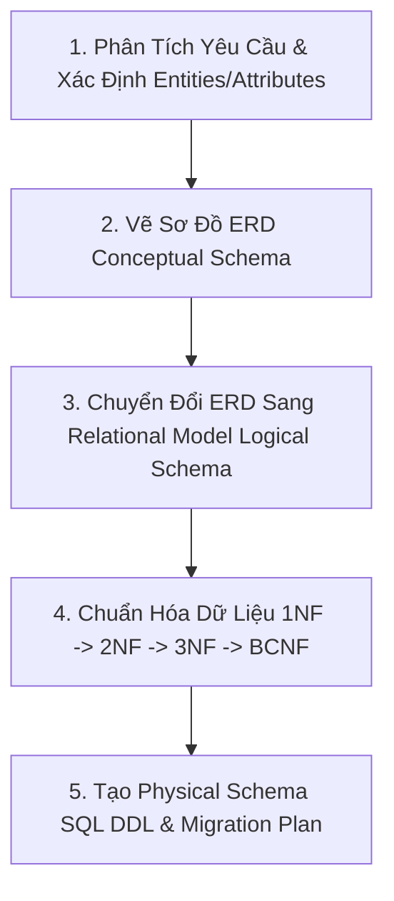

# Database Systems Design Skill (ERD & Relational Model)

Tài liệu này định nghĩa quy trình thiết kế Cơ sở Dữ liệu chuẩn học thuật (Database Management Systems - DBMS Theory) từ khảo sát yêu cầu, vẽ sơ đồ ERD, chuyển đổi sang Mô hình Quan hệ (Relational Model), chuẩn hóa dữ liệu (1NF -> 3NF/BCNF) đến sinh mã SQL DDL Schema.

---

## 1. Quy Trình 5 Bước Thiết Kế CSDL Chuẩn



---

## 2. Quy Tắc Thiết Kế Sơ Đồ ERD (Conceptual Design)

### 2.1. Phân Loại Thành Phần TRONG ERD

1. **Entities (Thực thể)**:
   - **Strong Entity (Thực thể mạnh)**: Tồn tại độc lập, có thuộc tính khóa chính (PK). Ký hiệu hình chữ nhật nét đơn.
   - **Weak Entity (Thực thể yếu)**: Phụ thuộc sự tồn tại của thực thể chủ (Owner Entity). Không có khóa chính riêng mà dùng Khóa bán phần (Partial Key / Discriminator). Ký hiệu hình chữ nhật nét đôi.

2. **Attributes (Thuộc tính)**:
   - **Key Attribute (Thuộc tính khóa)**: Gạch chân tên thuộc tính (`<u>id</u>`).
   - **Simple Attribute (Thuộc tính đơn)**: Giá trị nguyên tố (ví dụ: `age`, `email`).
   - **Composite Attribute (Thuộc tính phức hợp)**: Gồm nhiều thuộc tính thành phần (ví dụ: `Name` = `Ho` + `Ten`).
   - **Multivalued Attribute (Thuộc tính đa trị)**: Có thể có nhiều giá trị (ví dụ: `phone_numbers`). Ký hiệu hình elip nét đôi.
   - **Derived Attribute (Thuộc tính dẫn xuất)**: Tính toán từ thuộc tính khác (ví dụ: `date_of_birth` -> `age`). Ký hiệu hình elip nét đứt.

3. **Relationships (Mối quan hệ)**:
   - **Cardinality Ratio (Bản số)**: `1-1` (Một-Một), `1-N` (Một-Nhiều), `N-M` (Nhiều-Nhiều).
   - **Participation Constraint (Mức độ tham gia)**:
     - **Total Participation (Tham gia toàn phần / Phụ thuộc tồn tại)**: Mọi thực thể phải tham gia mối quan hệ. Ký hiệu đường đôi (double line).
     - **Partial Participation (Tham gia một phần)**: Một số thực thể có thể không tham gia. Ký hiệu đường đơn.

---

## 3. Quy Tắc Chuyển Đổi ERD Sang Mô Hình Quan Hệ (Relational Model Conversion Rules)

Quy trình chuyển đổi 7 bước chuẩn lý thuyết Elmasri & Navathe:

### Rule 1: Strong Entity Types (Thực thể mạnh)
- Tạo 1 quan hệ $R$ cho mỗi thực thể mạnh.
- Khóa chính $PK(R)$ là thuộc tính khóa của thực thể.

### Rule 2: Weak Entity Types (Thực thể yếu)
- Tạo 1 quan hệ $R$ cho mỗi thực thể yếu.
- Thêm khóa chính của thực thể chủ (Owner Entity) làm Khóa ngoại $FK$ trong $R$.
- Khóa chính $PK(R) = \{FK_{owner}, Partial\_Key\}$.

### Rule 3: Binary 1:1 Relationships (Quan hệ 1-1)
- **Cơ chế Foreign Key Approach**: Chọn thực thể có Total Participation (Tham gia toàn phần) làm bảng chứa Khóa ngoại $FK$ trỏ đến $PK$ của thực thể còn lại. Thêm thuộc tính của mối quan hệ (nếu có) vào quan hệ chứa $FK$.

### Rule 4: Binary 1:N Relationships (Quan hệ 1-N)
- Đưa khóa chính $PK$ của phía `1` sang làm Khóa ngoại $FK$ bên quan hệ phía `N`.
- Thêm các thuộc tính của mối quan hệ (nếu có) vào phía `N`.

### Rule 5: Binary N:M Relationships (Quan hệ N-M)
- Bắt buộc tạo một quan hệ mới gọi là **Junction Relation (Bảng trung gian)** $S$.
- Thêm khóa chính của cả 2 quan hệ tham gia vào $S$ làm các Khóa ngoại ($FK_1, FK_2$).
- Khóa chính của $S$ là sự kết hợp $PK(S) = \{FK_1, FK_2\}$.

### Rule 6: Multivalued Attributes (Thuộc tính đa trị)
- Tạo 1 quan hệ mới $R_{multi}$ chứa thuộc tính đa trị đó và $PK$ của thực thể chủ (làm $FK$).
- $PK(R_{multi}) = \{FK_{owner}, Multivalued\_Attribute\}$.

### Rule 7: N-ary Relationships (Quan hệ $n$-ngôi với $n > 2$)
- Tạo quan hệ mới đại diện cho mối quan hệ $n$-ngôi.
- Đưa $PK$ của tất cả các thực thể tham gia vào làm các Khóa ngoại $FK_1, FK_2, \dots, FK_n$.
- Khóa chính thường là tập hợp tất cả các $FK$ này.

---

## 4. Lý Thuyết Chuẩn Hóa Cơ Sở Dữ Liệu (Normalization Theory)

### 4.1. Dạng Chuẩn 1 (1NF - First Normal Form)
- **Điều kiện**: Tất cả các thuộc tính đều chứa **giá trị nguyên tố (Atomic values)**.
- **Loại bỏ**: Lặp nhóm (repeating groups), thuộc tính đa trị (multivalued attributes), thuộc tính phức hợp.

### 4.2. Dạng Chuẩn 2 (2NF - Second Normal Form)
- **Điều kiện**: Đạt 1NF AND **Mọi thuộc tính không khóa phải phụ thuộc hàm đầy đủ vào khóa chính** (No Partial Functional Dependency).
- **Loại bỏ**: Phụ thuộc hàm một phần (nếu khóa chính là khóa phức hợp gồm nhiều thuộc tính, thuộc tính không khóa không được chỉ phụ thuộc vào một phần của khóa chính).

### 4.3. Dạng Chuẩn 3 (3NF - Third Normal Form)
- **Điều kiện**: Đạt 2NF AND **Không có thuộc tính không khóa nào phụ thuộc bắc cầu vào khóa chính** (No Transitive Functional Dependency).
- **Quy tắc kiểm tra Phụ thuộc hàm $X \to Y$**:
  - $X \to Y$ là phụ thuộc hàm hiển nhiên ($Y \subseteq X$), HOẶC
  - $X$ là một Siêu khóa (Superkey), HOẶC
  - Mỗi thuộc tính trong $Y \setminus X$ là thuộc tính khóa (Prime Attribute).

### 4.4. Dạng Chuẩn Boyce-Codd (BCNF)
- **Điều kiện**: Với mọi phụ thuộc hàm không hiển nhiên $X \to Y$, $X$ bắt buộc phải là một **Siêu khóa (Superkey)**.

---
## 5. Suy Luận Tự Động Ràng Buộc & Logic Nghiệp Vụ (Constraints, Triggers & Views)

Khi nhận yêu cầu từ người dùng, Agent **KHÔNG CHỈ** dừng lại ở việc tạo bảng và khóa chính/khóa ngoại, mà **BẮT BUỘC PHẢI TỰ SUY LUẬN VÀ BỔ SUNG**:

### 5.1. Ràng Buộc Miền Giá Trị (Domain Integrity & CHECK Constraints)
Tự động suy luận các quy tắc toàn vẹn từ ngữ cảnh thực tế:
- **Độ dài & Định dạng SĐT**: `CHECK (sodt ~ '^[0-9]{10,11}$')`
- **Khối lớp**: `CHECK (khoi_lop BETWEEN 1 AND 12)`
- **Điểm số**: `CHECK (diem >= 0.0 AND diem <= 10.0)`
- **Khoảng thời gian**: `CHECK (ngay_ket_thuc >= ngay_bat_dau)`
- **Trạng thái (Enum Check)**: `CHECK (trang_thai IN ('ACTIVE', 'INACTIVE', 'SUSPENDED'))`
- **Email hợp lệ**: `CHECK (email ~* '^[A-Za-z0-9._%+-]+@[A-Za-z0-9.-]+\.[A-Za-z]{2,}$')`

### 5.2. Database Triggers & Stored Functions (PL/pgSQL)
Bắt buộc bổ sung các Trigger tự động hóa:
1. **Trigger Tự Động Cập Nhật `updated_at`**:
   ```sql
   CREATE OR REPLACE FUNCTION update_updated_at_column()
   RETURNS TRIGGER AS $$
   BEGIN
       NEW.updated_at = CURRENT_TIMESTAMP;
       RETURN NEW;
   END;
   $$ LANGUAGE plpgsql;
   ```
2. **Trigger Kiểm Tra / Tính Toán Nghiệp Vụ**:
   - Tự động cập nhật sĩ số lớp học khi thêm/xóa học sinh.
   - Tự động tính điểm trung bình môn hoặc tổng học phí.
   - Trigger Audit Log ghi lại lịch sử thay đổi thông tin quan trọng.

### 5.3. Views & Materialized Views (Khái Quát Hóa Báo Cáo)
Thiết kế sẵn các `VIEW` phục vụ việc truy vấn và trích xuất dữ liệu nhanh:
- `v_danh_sach_lop_hoc`: View kết hợp thông tin Học sinh, Lớp học và Giáo viên.
- `v_thong_ke_si_so`: View thống kê tổng số lượng học sinh theo môn và khối lớp.

### 5.4. Supabase Row-Level Security (RLS Policies)
Quy định phân quyền dữ liệu mức dòng:
- Bật RLS: `ALTER TABLE table_name ENABLE ROW LEVEL SECURITY;`
- Đặt Policy cho Admin, Giáo viên và Học sinh.

---

## 6. Định Dạng Xuất Tài Liệu Chuẩn Mẫu (Standard Output Format)

Khi viết tài liệu CSDL cho người dùng, luôn trình bày đầy đủ 5 phần chuẩn mực sau:

### Phần 1: Phân Tích Thực Thể & Thuộc Tính (Entities & Attributes)
### Phần 2: Sơ Đồ ERD (Mermaid Diagram Code Block)
### Phần 3: Relational Data Model (Mô hình quan hệ dạng ký hiệu lý thuyết)
- Ký hiệu: `TenBang(<u>KhoaChinh</u>, ThuocTinh1, ThuocTinh2, KhoaNgoai -> TenBangKhac(KhoaChinh))`
### Phần 4: Phân Tích Dạng Chuẩn (1NF -> 2NF -> 3NF / BCNF Proof)
### Phần 5: Production-Ready SQL DDL Schema & Triggers (PostgreSQL / Supabase)
- Có đầy đủ: `PRIMARY KEY`, `FOREIGN KEY`, `NOT NULL`, `UNIQUE`, `CHECK Constraints`, `INDEXES`, `TRIGGERS` và `VIEWS`.

