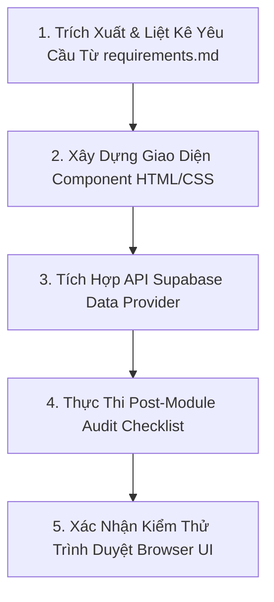

# EduManager V2 Web Application Development Skill

Tài liệu này định nghĩa quy trình, phương pháp kiểm tra tính năng (Feature Audit) và tiêu chuẩn phát triển ứng dụng Web **EduManager V2** dựa trên tài liệu yêu cầu nghiệp vụ [requirements.md](file:///c:/Users/ACER/Desktop/grow/requirements.md).

---

## 1. Nguyên Tắc Cốt Lõi: Đảm Bảo 100% Tính Năng (Zero Missing Features)

1. **Rà Soát Toàn Diện Tất Cả Các Mục Trong `requirements.md`**:
   - Mọi quy định nghiệp vụ ở **Mục 1 đến Mục 3** (Nhập học giữa chừng đợt X, Chuyển lớp đợt Y, Chuyển lớp A -> B -> A, Nợ cũ liên niên khóa, Quyết toán lương GV theo đợt, SĐT tùy chọn...) **BẮT BUỘC PHẢI DỰNG THÀNH TÍNH NĂNG GIAO DIỆN**.
   - Nếu một quy định nghiệp vụ được nêu ở Mục 1-3 nhưng chưa được mô tả chi tiết ở Mục 4 (Mô tả Module Giao diện), Lập trình viên **BẮT BUỘC PHẢI CHỌN VỊ TRÍ GIAO DIỆN THÍCH HỢP ĐỂ TÍCH HỢP** (ví dụ: Modal Chuyển Lớp, Modal Thêm Học Sinh, Badge Cảnh Báo POS, Tab Lịch Sử Ghi Danh, Dropdown Chọn Đợt...).

2. **Quy Trình Kiểm Tra Tính Năng Sau Khi Xong Mỗi Module (Post-Module Audit Checklist)**:
   - Sau khi hoàn thành mã nguồn của **MỖI MODULE** (ví dụ: Module Học sinh, Module Lớp học, Module POS...), Lập trình viên **BẮT BUỘC PHẢI ĐỐI SOÁT** danh sách tính năng thực tế đã chạy với [requirements.md](file:///c:/Users/ACER/Desktop/grow/requirements.md).
   - Tuyệt đối không chuyển sang Module tiếp theo nếu Module hiện tại còn thiếu tính năng hoặc chưa xử lý hết các trường hợp biên (edge cases).

3. **Cập Nhật & Tái Hiển Thị Giao Diện Tức Thì (Instant UI Re-render & Auto-Refresh)**:
   - **Tất cả các thao tác thay đổi dữ liệu (Thêm mới, Cập nhật, Chuyển lớp, Đổi trạng thái, Lập biên lai, Xóa)** BẮT BUỘC PHẢI tự động gọi hàm re-fetch/re-render (`load...Data()` hoặc `render...DetailView()`) NGAY LẬP TỨC sau khi API phản hồi thành công.
   - **Không bao giờ** để giao diện ở trạng thái stale data hoặc bắt người dùng phải F5 / Reload trang thủ công để thấy dữ liệu mới vừa cập nhật.

---

## 2. Quy Trình Phát Triển Module 5 Bước (5-Step Module Workflow)

### Bước 1: Trích Xuất & Liệt Kê Yêu Cầu
- Đọc [requirements.md](file:///c:/Users/ACER/Desktop/grow/requirements.md) và ghi nhận danh sách checklist tính năng của Module sắp làm (bao gồm cả các quy tắc nghiệp vụ ở Mục 1-3).

### Bước 2: Dựng Giao Diện & Component HTML/CSS
- Thiết kế giao diện hiện đại, sử dụng CSS design system có cấu trúc, màu sắc hài hòa, phản hồi tương tác mượt mà.
- Tránh sử dụng placeholder cứng.

### Bước 3: Tích Hợp API Supabase Data Provider
- Kết nối trực tiếp với CSDL PostgreSQL trên Supabase (`https://pvlyaubewwhgzhirmwgi.supabase.co`).
- Đảm bảo xử lý đúng các hàm query, filter, insert, update, delete và hỗ trợ phân trang/tìm kiếm.

### Bước 4: Thực Thi Post-Module Audit Checklist (Bắt buộc)
- Rà soát lại từng bullet point trong [requirements.md](file:///c:/Users/ACER/Desktop/grow/requirements.md) cho Module đó.
- Xác nhận không có tính năng nào bị bỏ sót hay làm tắt.

### Bước 5: Kiểm Thử Trình Duyệt (Browser Verification)
- Khởi chạy server và trực tiếp kiểm thử luồng thao tác trên browser, đảm bảo không có lỗi console hay crash giao diện.

---

## 3. Checklist Rà Soát Chi Tiết Theo Module (Feature Audit Checklist)

### 3.1. Header & Navigation Chung
- [ ] Tên đơn vị: **Trung Tâm Ngoại Ngữ Grow**.
- [ ] **Quick Switcher 1-Click**: Chuyển nhanh giữa 3 vai trò `ADMIN`, `CASHIER`, `TEACHER`.
- [ ] **Academic Year Selector**: Chọn Niên khóa (`2025-2026`, `2026-2027`...) đồng bộ toàn bộ dữ liệu.

### 3.2. Module 1: Dashboard
- [ ] 4 Thẻ chỉ số tổng quan (Doanh thu hôm nay, Số học sinh, Lớp hoạt động, Lớp kết thúc).
- [ ] Bảng danh sách Lớp học kết thúc cần thu nợ + Nút thao tác mở POS nhanh.

### 3.3. Module 2: Quản Lý Học Sinh (Students)
- [ ] Ô tìm kiếm Học sinh (Họ tên, SĐT, Mã HS).
- [ ] Form Thêm/Sửa Học Sinh: SĐT tùy chọn (không bắt buộc).
- [ ] **Trang Chi Tiết Học Sinh Full-Page**:
  - Profile Card + Nút Sửa thông tin.
  - Tab 1: Lớp Đã Ghi Danh (Tên lớp, Đợt bắt đầu `start_batch_number`, Đợt kết thúc `end_batch_number`, Ngày đăng ký, Trạng thái `ACTIVE`/`TRANSFERRED`).
  - Nút **Chuyển Lớp / Nhập Học Lớp Mới**: Chọn Lớp mới, Chọn Đợt bắt đầu `start_batch_number`, Tự động lưu Đợt kết thúc lớp cũ `end_batch_number`.
  - Tab 2: Lịch Sử Biên Lai (Hiển thị chi tiết từng mục đóng: Tên Lớp - Đợt học - Số tiền).

### 3.4. Module 3: Quản Lý Lớp Học (Classes)
- [ ] Ô tìm kiếm & Bộ lọc theo Năm học.
- [ ] Form Tạo Lớp Học Mới: Tự động khởi tạo đủ 12 Đợt học (`batches`).
- [ ] **Trang Chi Tiết Lớp Học Full-Page**:
  - Tab 1: Quản lý 12 Đợt Học (Tên đợt, Học phí đợt, Trạng thái, Giáo viên phụ trách đợt + Modal Sửa Đợt).
  - Tab 2: Danh sách Học sinh trong lớp (Sĩ số thực tế theo từng đợt).

### 3.5. Module 4: Quản Lý Giáo Viên (Teachers)
- [ ] Ô tìm kiếm & Form Thêm/Sửa Giáo Viên (SĐT tùy chọn, Dropdown chọn Môn chuyên môn).
- [ ] **Trang Chi Tiết Giáo Viên Full-Page**:
  - Tab 1: Danh sách Lớp & Đợt phân công dạy.
  - Tab 2: Báo cáo Thù Lao & Doanh Thu Đợt (Payroll) tính chuẩn theo đợt giáo viên trực tiếp dạy.

### 3.6. Module 5: POS Thu Tiền Học Phí & Tra Cứu Nợ Phí
- [ ] Tìm kiếm học sinh tự động gợi ý.
- [ ] Banner Cảnh báo Học sinh mới / Lần đầu đóng phí cho lớp.
- [ ] **Hiển thị 12 Đợt học phân nhóm theo Lớp**:
  - Màu sắc nhận diện đợt (🟢 Đã đóng, 🟡 Đợt hiện tại, 🔵 Sắp tới, 🔴 Nợ quá hạn).
  - Hiển thị cả **Khoản nợ đợt cũ ở Lớp cũ** (bảo lưu) và **Học phí Lớp mới**.
- [ ] Khung lập biên lai (`In máy` / `Nhập tay`), tự tính tổng tiền, in phiếu thu mẫu chuẩn.
- [ ] Báo cáo Tra cứu Nợ Phí theo Lớp & Đợt.
