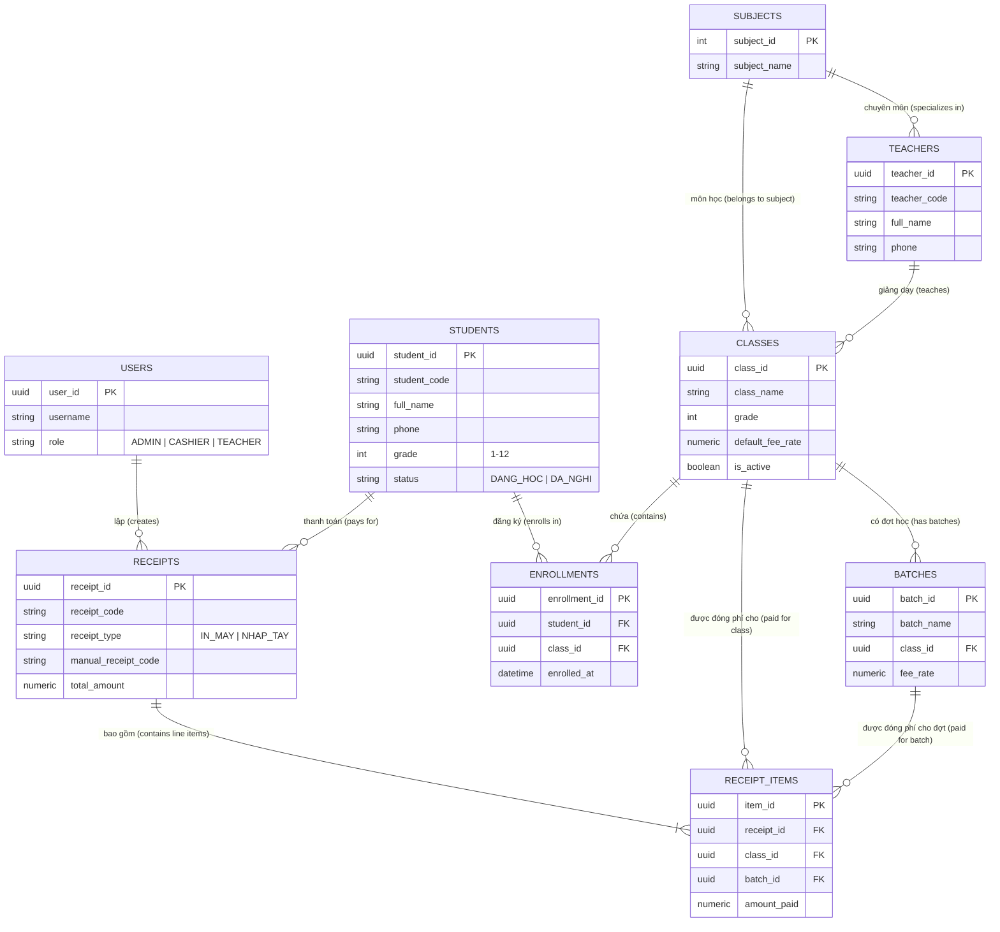

# BÁO CÁO THIẾT KẾ SƠ ĐỒ ERD (CONCEPTUAL DATABASE DESIGN)
## DỰ ÁN: EDUMANAGER V2 (QUẢN LÝ TRUNG TÂM DẠY THÊM)

---

## 1. PHÂN TÍCH CÁC THỰC THỂ (ENTITIES) & THUỘC TÍNH (ATTRIBUTES)

Dựa trên tài liệu yêu cầu nghiệp vụ [requirements.md](file:///c:/Users/ACER/Desktop/grow/requirements.md), hệ thống bao gồm 9 thực thể chính:

### 1.1. Thực thể `USERS` (Người dùng hệ thống)
- **Loại thực thể**: Thực thể mạnh (Strong Entity).
- **Thuộc tính**:
  - `<u>user_id</u>` (UUID): Khóa chính.
  - `username` (VARCHAR): Tên đăng nhập (Duy nhất - UNIQUE).
  - `password_hash` (VARCHAR): Mật khẩu đã mã hóa.
  - `full_name` (VARCHAR): Họ và tên người dùng.
  - `role` (ENUM): Vai trò truy cập (`ADMIN`, `CASHIER`, `TEACHER`).
  - `created_at` (TIMESTAMP): Thời gian tạo tài khoản.

### 1.2. Thực thể `SUBJECTS` (Danh mục Môn học)
- **Loại thực thể**: Thực thể mạnh (Strong Entity).
- **Thuộc tính**:
  - `<u>subject_id</u>` (SERIAL/INT): Khóa chính.
  - `subject_code` (VARCHAR): Mã môn học (vd: `TOAN`, `VAN`, `LY`, `HOA`, `AV`, `GVNN`).
  - `subject_name` (VARCHAR): Tên môn học (Duy nhất - UNIQUE).

### 1.3. Thực thể `TEACHERS` (Giáo viên)
- **Loại thực thể**: Thực thể mạnh (Strong Entity).
- **Thuộc tính**:
  - `<u>teacher_id</u>` (UUID): Khóa chính.
  - `teacher_code` (VARCHAR): Mã giáo viên (Duy nhất - UNIQUE, vd: `GV001`).
  - `full_name` (VARCHAR): Họ và tên giáo viên.
  - `phone` (VARCHAR): Số điện thoại (Chỉ lưu 1 SĐT, CHECK định dạng 10-11 số).
  - `specialization_subject_id` (INT): Khóa ngoại trỏ đến `SUBJECTS`.

### 1.4. Thực thể `STUDENTS` (Học sinh)
- **Loại thực thể**: Thực thể mạnh (Strong Entity).
- **Thuộc tính**:
  - `<u>student_id</u>` (UUID): Khóa chính.
  - `student_code` (VARCHAR): Mã học sinh tự động sinh (Duy nhất - UNIQUE, vd: `HS0001`).
  - `full_name` (VARCHAR): Họ và tên học sinh.
  - `phone` (VARCHAR): Số điện thoại liên lạc chính (1 SĐT duy nhất).
  - `grade` (INT): Khối lớp hiện tại (CHECK `grade BETWEEN 1 AND 12`).
  - `status` (ENUM): Trạng thái học (`DANG_HOC`, `DA_NGHI`, `DA_TN`).
  - `notes` (TEXT): Ghi chú tự do (hẹn ngày đóng tiền, tình trạng học...).

### 1.5. Thực thể `CLASSES` (Lớp học)
- **Loại thực thể**: Thực thể mạnh (Strong Entity).
- **Thuộc tính**:
  - `<u>class_id</u>` (UUID): Khóa chính.
  - `class_name` (VARCHAR): Tên lớp học (vd: `Lớp 6A - Toán`, `Lớp 6A - Văn`).
  - `grade` (INT): Khối lớp (1 - 12).
  - `subject_id` (INT): Khóa ngoại trỏ đến `SUBJECTS`.
  - `teacher_id` (UUID): Khóa ngoại trỏ đến `TEACHERS`.
  - `default_fee_rate` (NUMERIC): Mức học phí gốc cho 1 đợt học.
  - `is_active` (BOOLEAN): Trạng thái lớp (Mở/Khóa).

### 1.6. Thực thể `ENROLLMENTS` (Danh sách Ghi danh Lớp học)
- **Loại thực thể**: Thực thể trung gian (Junction Entity cho mối quan hệ N-M giữa `STUDENTS` và `CLASSES`).
- **Thuộc tính**:
  - `<u>enrollment_id</u>` (UUID): Khóa chính.
  - `student_id` (UUID): Khóa ngoại trỏ đến `STUDENTS`.
  - `class_id` (UUID): Khóa ngoại trỏ đến `CLASSES`.
  - `enrolled_at` (TIMESTAMP): Ngày ghi danh vào lớp.
  - `status` (ENUM): Trạng thái (`ACTIVE`, `WITHDRAWN`).

### 1.7. Thực thể `BATCHES` (Đợt học)
- **Loại thực thể**: Thực thể mạnh (Strong Entity).
- **Thuộc tính**:
  - `<u>batch_id</u>` (UUID): Khóa chính.
  - `batch_name` (VARCHAR): Tên đợt học (vd: `Đợt 1`, `Đợt 2`, `Tháng 09/2026`).
  - `class_id` (UUID): Khóa ngoại trỏ đến `CLASSES` (Có thể NULL nếu là đợt dùng chung).
  - `fee_rate` (NUMERIC): Học phí quy định của đợt này.

### 1.8. Thực thể `RECEIPTS` (Biên lai Thu tiền Header)
- **Loại thực thể**: Thực thể mạnh (Strong Entity).
- **Thuộc tính**:
  - `<u>receipt_id</u>` (UUID): Khóa chính.
  - `receipt_code` (VARCHAR): Mã biên lai hệ thống (Duy nhất - UNIQUE, vd: `REC-2026-0001`).
  - `receipt_type` (ENUM): Loại biên lai (`IN_MAY`, `NHAP_TAY`).
  - `manual_receipt_code` (VARCHAR): Số biên lai tay / Mã tham chiếu (Dành cho loại `NHAP_TAY`).
  - `student_id` (UUID): Khóa ngoại trỏ đến `STUDENTS`.
  - `created_by_user_id` (UUID): Khóa ngoại trỏ đến `USERS` (Người lập).
  - `receipt_date` (TIMESTAMP): Ngày giờ lập biên lai.
  - `total_amount` (NUMERIC): Tổng tiền thực thu của biên lai.

### 1.9. Thực thể `RECEIPT_ITEMS` (Chi tiết từng Dòng Thanh toán Biên lai)
- **Loại thực thể**: Thực thể yếu (Weak Entity thuộc `RECEIPTS`).
- **Thuộc tính**:
  - `<u>item_id</u>` (UUID): Khóa chính.
  - `receipt_id` (UUID): Khóa ngoại trỏ đến `RECEIPTS`.
  - `class_id` (UUID): Khóa ngoại trỏ đến `CLASSES`.
  - `batch_id` (UUID): Khóa ngoại trỏ đến `BATCHES`.
  - `amount_paid` (NUMERIC): Số tiền thực thu của mục này.
  - `item_note` (VARCHAR): Ghi chú dòng.

---

## 2. SƠ ĐỒ ERD (ENTITY-RELATIONSHIP DIAGRAM)

---

## 3. PHÂN TÍCH MỐI QUAN HỆ & BẢN SỐ (CARDINALITY RATIOS)

1. `SUBJECTS` - `TEACHERS`: **1 - N** (Một môn học có nhiều giáo viên chuyên môn; Một giáo viên có 1 môn chuyên môn chính).
2. `TEACHERS` - `CLASSES`: **1 - N** (Một giáo viên dạy nhiều lớp; Mỗi lớp có đúng 1 giáo viên phụ trách).
3. `SUBJECTS` - `CLASSES`: **1 - N** (Một môn học có nhiều lớp; Mỗi lớp thuộc đúng 1 môn học).
4. `STUDENTS` - `CLASSES`: **N - M** (Một học sinh có thể ghi danh vào nhiều lớp khác nhau; Một lớp chứa nhiều học sinh). Chuyển thành 2 mối quan hệ 1-N thông qua bảng trung gian `ENROLLMENTS`.
5. `CLASSES` - `BATCHES`: **1 - N** (Một lớp học trải qua nhiều đợt học theo thời gian).
6. `STUDENTS` - `RECEIPTS`: **1 - N** (Một học sinh có nhiều biên lai thanh toán trong lịch sử).
7. `USERS` - `RECEIPTS`: **1 - N** (Một nhân viên/thu ngân lập nhiều biên lai).
8. `RECEIPTS` - `RECEIPT_ITEMS`: **1 - N (Total Participation)** (Một biên lai chứa ít nhất 1 hoặc nhiều dòng thanh toán chi tiết).
